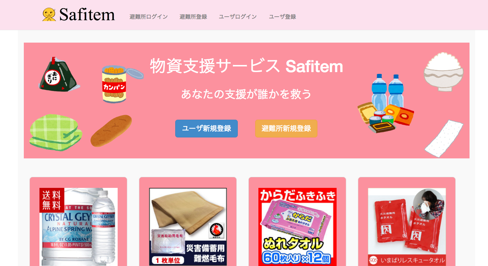

#Safitem

避難所で不足している品物一覧を表示し，避難所と物資支援をしてくれる企業，個人を結ぶサービス

#開発手順

Ruby(Sinatra)で動いているので，Rubyが書ける環境にしておいてください．

RubyのGemを管理する仕組みであるBundlerをインストール．

`gem install bundler`

そしたら，`bundle install`を行い，必要Gemを入れます．

まずは
[楽天APIアプリ登録](https://grp02.id.rakuten.co.jp/rms/nid/login?service_id=i14&lang=ja&login_ticket=c6e7bd27b847b8c6bae8c09c184dc0a9&return_url=%2Fapp%2Fcreate)
よりアプリIDを取得してください．※楽天IDが必須です．

取得できたら，`APPLICATION_ID=所得したアプリケーションID`で環境変数にアプリケーションIDを設定します．

マイグレーションを行う必要があるので，`rake db:migrate`を行います．

seeds.rbに避難所3つ分のデータとユーザ3人分のデータを書いておいたので，`rake db:seeds`でデータベースに避難所データとユーザデータが記録されます．

その後，`rackup config.ru`でSafitemが起動します．

`localhost:9292`でSafitemが起動しているので，ブラウザで確認しながら開発を行っていきます．

プルリクエスト待っています．

どんどんissueも立てて良くしていきたいなと．

##To Do

ユーザ，避難所間でメッセージのやり取りができる機能を付けたい

決算もこのアプリ内でできたらいいと思う

「パスワードを忘れた」の処理もいります．

トップページの画像，ウインドウサイズ変えたら表示おかしくなるのを早急に直す．

#以下メモ

##設計

###ビュー構成

####index.erb

トップページ．とりあえず今はリンクを作っておくだけ．あとログイン，ログアウト画面とか．

####show_shelters.erb

避難所一覧ページ．ここから，各避難所が欲しがってる品物一覧のページに飛べるようにする．

####shelter_items.erb

避難所別の欲しがっているもの一覧表示ページ

####search_items.erb

商品検索画面

####search_result.erb

商品検索結果画面

####support_list.erb

自分の避難所を支援してくれる人を表示する画面．

###データベース構成

####避難所
名前，住所，メールアドレス(ログインで使う)，電話番号，避難者数，代表者名，id

####寄付者

名前，住所，メールアドレス，電話番号，id，ユーザタイプ

####中間テーブル

避難所idとitemsのid

####items

id,item_code,name,url,price

###デザイン構成

####テーマカラー

\#FC919E

###素材

いらすとや http://www.irasutoya.com/

